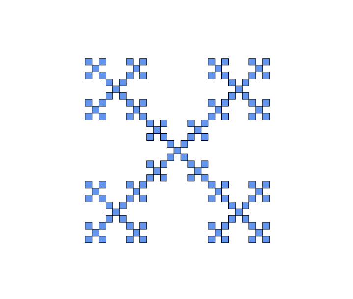
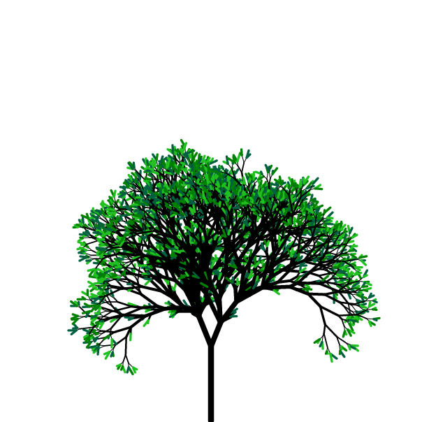
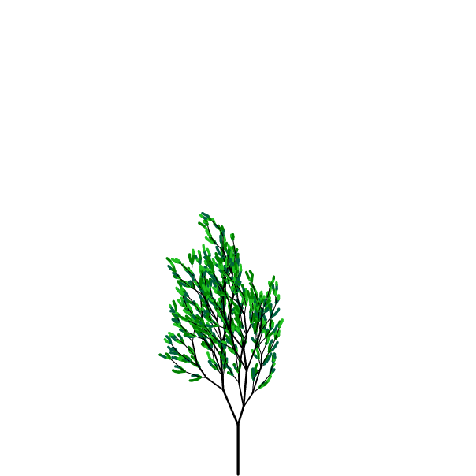

# L-System

L-System is some algorithm to create fractal art.
The main idea of this system:
- Firstly, we create the initial string
and some rule to transform each symbol of this string into substring.
- Than, we start act according to the rule for every symbol in String.
- Repeat previous step several times.

Example:
* Start string is: F
* Rule is:
  * F  -->  F-F+F+F-F
* The first iteration:
  * F __-__ F __+__ F __+__ F __-__ F
* Second one:
  * *F-F+F+F-F* __-__ F-F+F+F-F __+__ *F-F+F+F-F*
  __+__ F-F+F+F-F __-__ *F-F+F+F-F*

# Graphical representation

For graphical view we can use **Python** with pre-installed instrument -- Turtle.
 After generating the string, we will give it to the turtle. Each symbol is instruction for the turtle:
* 'F' -- one step forward;
* '+' -- turn right by 90 degrees;
* '-' -- turn left by 90 degrees.

And we get the following result (number of iteration is 4th):
 

# Programs

In the repository there are tree exe files:
* L_System -- To generate fractal figure;
* Trees -- To generate something similar with a tree;
* TreeAnim -- Simple gif animation of a "growing" the tree.

[Instruction for this programs](/Instruction.md).

# Pictures

All picture and instruction exist in repository.

/L_System_4.png)

/TreeAnim3.gif)
